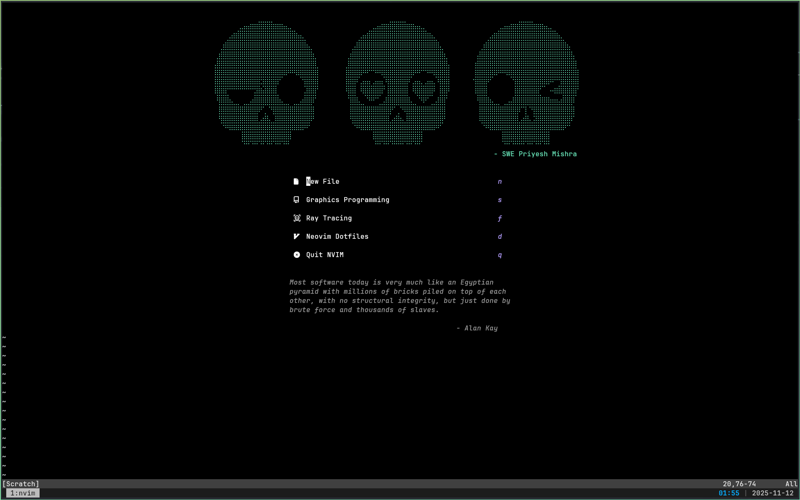
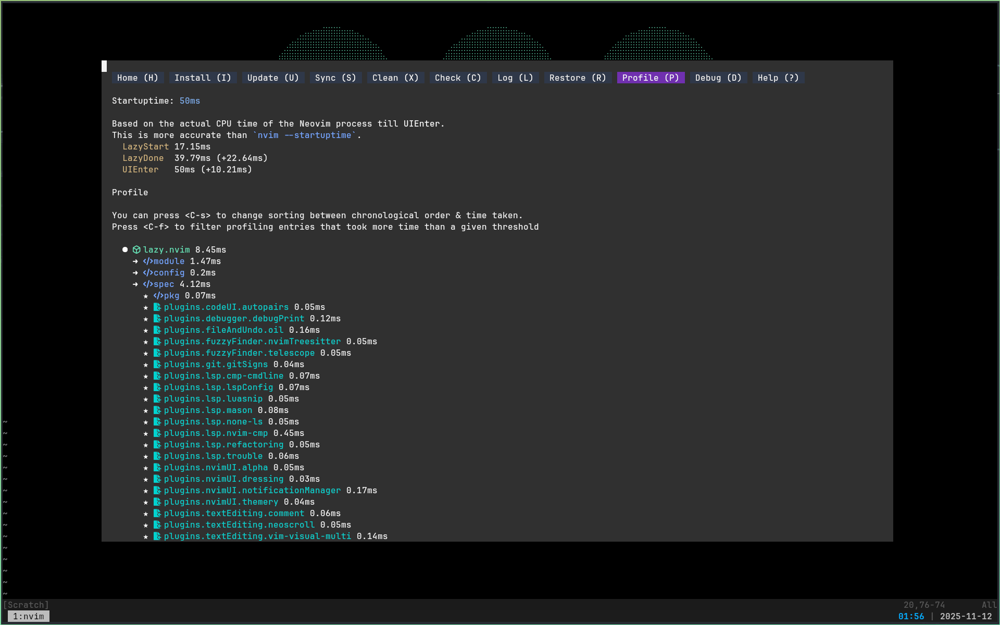
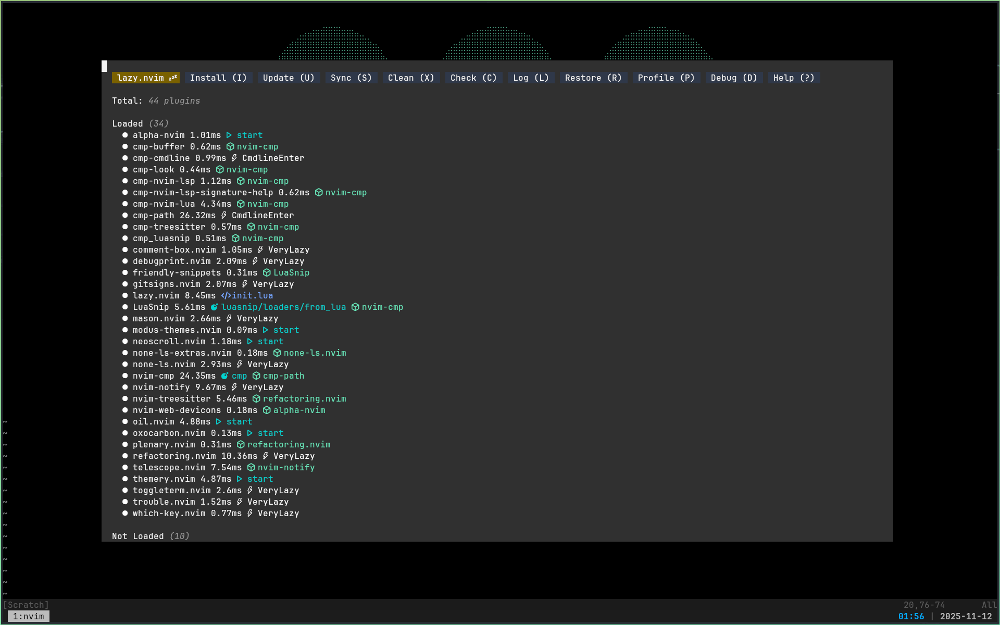
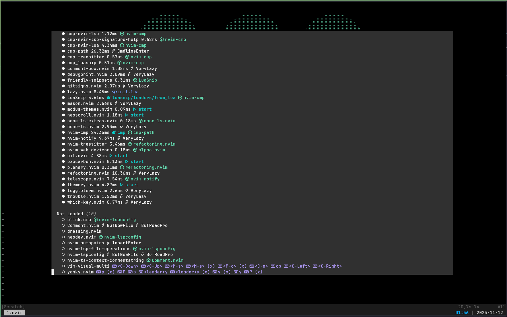
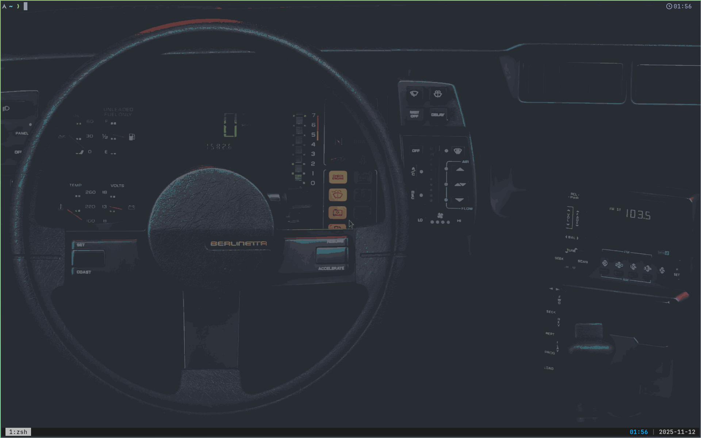
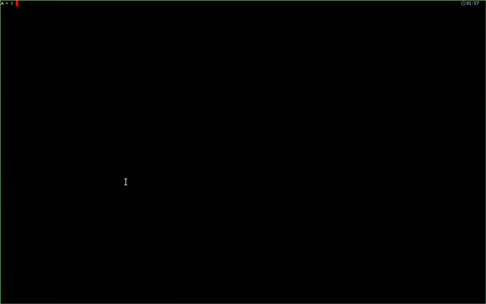

# Dotfiles

This repository contains the configuration (dotfiles) for my personal system setup an managed using [GNU Stow](https://www.gnu.org/software/stow/).

My configs are visually super minimalistic.
From neovim to kitty to wezterm.

## Images

---

---

---

---

---

---

## Requirements

- **Git**
  ```
  sudo pacman -S git

- **GNU Stow**
  ```
  sudo pacman -S stow

---

## Installation

Clone the repository into your `$HOME` directory:

```bash
mkdir -p dotfiles
git clone git@github.com/priyeshmishra235/dotfiles.git
cd dotfiles
```

Then use **GNU Stow** to create symlinks for the dotfiles:

```bash
stow .
```

If you want to adopt to existing files then use

```bash
stow . --adopt
```

---
